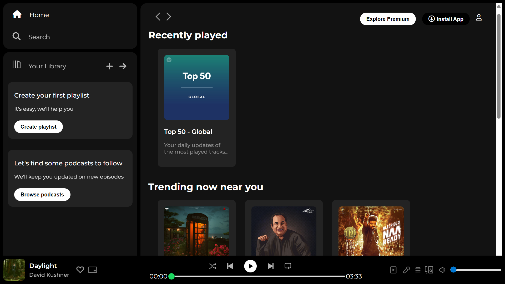

# 🎧 Spotify Clone - HTML & CSS

## 📖 Description

This project is a simple yet visually appealing **Spotify Clone** designed using **HTML** and **CSS**. It replicates the core layout and design of Spotify's web interface, providing a responsive and modern look suitable for frontend development practice. The project focuses on static UI elements, clean layout structure, and styling consistency.

---

## ✨ Features

- 🎨 **Responsive Layout**: The design adjusts smoothly across different screen sizes, ensuring an optimized experience on both desktop and mobile devices.
- 💻 **Clean UI Structure**: The layout follows Spotify’s iconic design style with a sidebar, header, playlist section, and footer music controls.
- 🖥️ **Pixel-Perfect Design**: Careful attention to detail ensures the clone mirrors the look and feel of the real Spotify interface.
- 🔥 **Modern Styling with CSS**: Utilizes pure CSS for styling, including grid, flexbox, hover effects, and consistent color schemes.
- ⚡ **No JavaScript Required**: Focuses entirely on frontend layout and design without interactivity for simplicity.

---

## 🛠️ Technologies Used

- **HTML5**: Provides the structure and semantic elements of the webpage.
- **CSS3**: Handles the layout, styling, responsiveness, and visual aesthetics.
- **Font Awesome**: For icons used throughout the web application.

---

## 🚀 How to Use

1. **Clone the Repository**
   ```bash
   git clone https://github.com/YourUsername/spotify-clone.git

2. **Open the Project**
- Locate the `index.html` file and open it with your preferred web browser.

3. **Explore the Layout**
- Browse through the sidebar, playlists, headers, and footer sections.
- Resize the window to see responsive behavior in action.

---

## 💻 Demo Screenshot



---

## 🎯 Future Enhancements

- Adding interactivity with **JavaScript** for play/pause functionality.
- Integrating audio playback features.
- Enhancing responsiveness for more devices.
- Adding hover animations and transitions.

---

## 🙏 Acknowledgements

- Inspired by **Spotify** for design inspiration.
- [Font Awesome](https://fontawesome.com/) - For icons used in the application.
 

